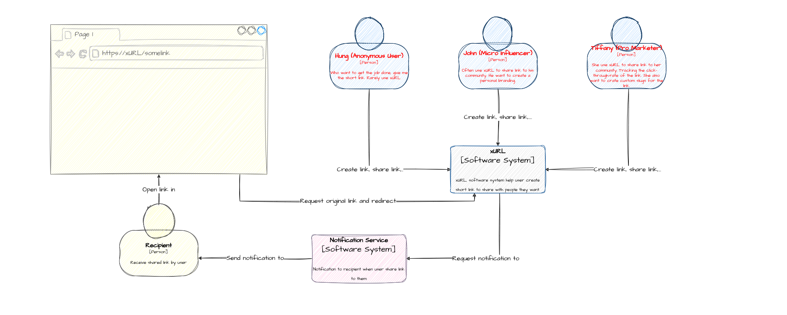
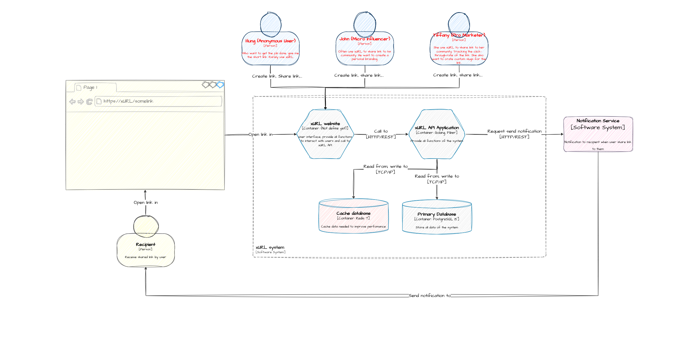

# xURL - Simple URL (Link) Shortener

xURL is a simple URL shortener written in Golang, Fiber. It uses a PostgreSQL database to store the URLs and their corresponding short codes. It is designed to be simple and easy to use.

It also use Redis to cache the short codes and their corresponding URLs.

## Table of Contents
[1.Overall architecture](#overall-architecture)<br>
[1.1. Context view](#context-view)<br>
[1.2. Container view](#container-view)<br>
[1.3. Component view (API Application)](#component-view-api-application)<br>
[1.4. Component view (Website)](#component-view-website-❌)<br>


## Overall architecture

### Context view



### Container view


### Component view (API Application)


### Component view (Website) ❌
Currently, I am working on the website. It will be available soon.

## Installation

### Clone the repository

```bash
git clone
```

### Install dependencies

```bash
go mod download
```

### Run the application

```bash
docker-compose up
```

### Check the application

```bash
# POST /api/v1/links
curl -X POST \
  http://localhost:3111/api/v1/links \
  -H 'Content-Type: application/json' \
  -d '{
  "originalLink": "https://www.google.com"
  }'
```
